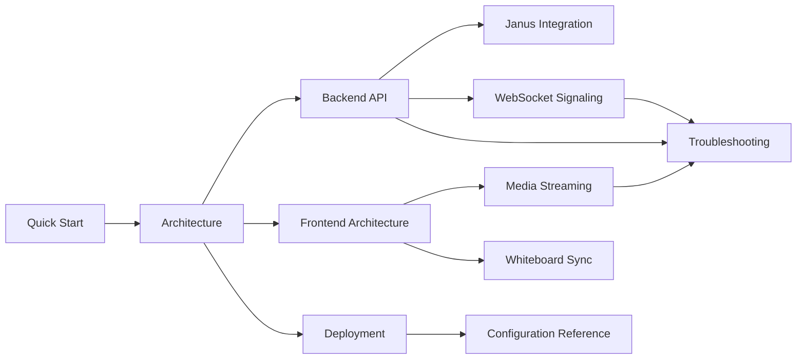

# GTS Meet Documentation

This folder contains the technical documentation for the GTS Meet video conferencing platform.

Audience:
- Developers extending frontend or backend behavior
- Operators deploying and troubleshooting Docker-based environments
- Stakeholders reviewing architecture and runtime behavior

## Contents

1. Getting Started
- [Quick Start](./QUICK_START.md)
- [Architecture](./ARCHITECTURE.md)

2. Backend and Janus Integration
- [Backend API](./BACKEND_API.md)
- [Janus Integration](./JANUS_INTEGRATION.md)
- [WebSocket Signaling](./WEBSOCKET_SIGNALING.md)

3. Frontend and Realtime Collaboration
- [Frontend Architecture](./FRONTEND_ARCHITECTURE.md)
- [Media Streaming](./MEDIA_STREAMING.md)
- [Whiteboard Sync](./WHITEBOARD_SYNC.md)

4. Operations
- [Deployment](./DEPLOYMENT.md)
- [Configuration Reference](./CONFIGURATION_REFERENCE.md)
- [Troubleshooting](./TROUBLESHOOTING.md)

## Suggested Reading Paths

Developer path:
1. [Quick Start](./QUICK_START.md)
2. [Architecture](./ARCHITECTURE.md)
3. [Frontend Architecture](./FRONTEND_ARCHITECTURE.md)
4. [Backend API](./BACKEND_API.md)
5. [WebSocket Signaling](./WEBSOCKET_SIGNALING.md)

Operator path:
1. [Quick Start](./QUICK_START.md)
2. [Deployment](./DEPLOYMENT.md)
3. [Configuration Reference](./CONFIGURATION_REFERENCE.md)
4. [Troubleshooting](./TROUBLESHOOTING.md)

## Documentation Map

## Glossary

- Room UUID: database room id (`Room.id` in Prisma).
- Janus room id (`janusId`): numeric room id used in Janus plugins.
- VideoRoom: Janus plugin used for audio/video media routing.
- TextRoom: Janus plugin used for data channel chat/signaling. In this repo it is a legacy fallback for some flows.
- Signaling WebSocket: backend channel at `/api/rooms/:roomId/ws` used for hand-raise and whiteboard events.
- SFU: Selective Forwarding Unit model where Janus forwards media between participants.

## Notes

- Primary signaling path for collaboration features is backend WebSocket signaling.
- TextRoom is still present and used as fallback in selected frontend paths.
- Keep this documentation in sync with code changes in backend `src` layers and frontend `janus`/`components` runtime logic.
