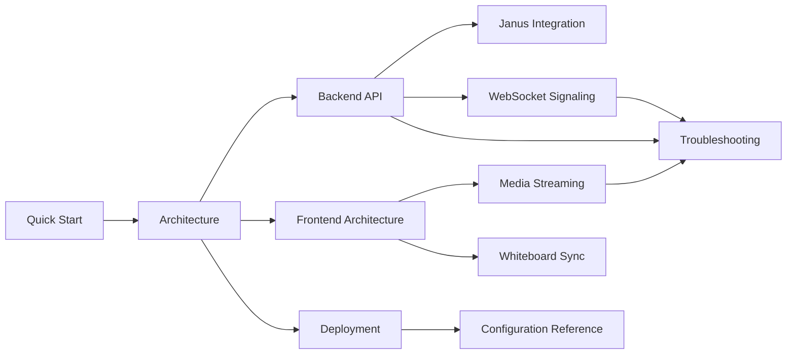

# GTS Meet Documentation

This folder contains the technical documentation for the GTS Meet video conferencing platform and the Janus-based meeting service it exposes to other GTS apps.

Audience:
- Developers extending frontend or backend behavior
- Operators deploying and troubleshooting Docker-based environments
- Stakeholders reviewing architecture and runtime behavior

Deployment model:
- Standalone self-hosted meetings: users can open this repo's frontend dashboard at `/` and create or join rooms directly.
- Separate VPS meeting backend: external apps such as `gts-academy-admin` and `Gts-candidate-app` can call this repo's backend API and then send users back to this frontend at `/room/:roomId`.

## Contents

1. Getting Started
- [Quick Start](./docs/QUICK_START.md)
- [Architecture](./docs/ARCHITECTURE.md)

2. Backend and Janus Integration
- [Backend API](./docs/BACKEND_API.md)
- [Janus Integration](./docs/JANUS_INTEGRATION.md)
- [WebSocket Signaling](./docs/WEBSOCKET_SIGNALING.md)

3. Frontend and Realtime Collaboration
- [Frontend Architecture](./docs/FRONTEND_ARCHITECTURE.md)
- [Media Streaming](./docs/MEDIA_STREAMING.md)
- [Whiteboard Sync](./docs/WHITEBOARD_SYNC.md)

4. Operations
- [Deployment](./docs/DEPLOYMENT.md)
- [Configuration Reference](./docs/CONFIGURATION_REFERENCE.md)
- [Troubleshooting](./docs/TROUBLESHOOTING.md)

## Suggested Reading Paths

Developer path:
1. [Quick Start](./docs/QUICK_START.md)
2. [Architecture](./docs/ARCHITECTURE.md)
3. [Frontend Architecture](./docs/FRONTEND_ARCHITECTURE.md)
4. [Backend API](./docs/BACKEND_API.md)
5. [WebSocket Signaling](./docs/WEBSOCKET_SIGNALING.md)

Operator path:
1. [Quick Start](./docs/QUICK_START.md)
2. [Deployment](./docs/DEPLOYMENT.md)
3. [Configuration Reference](./docs/CONFIGURATION_REFERENCE.md)
4. [Troubleshooting](./docs/TROUBLESHOOTING.md)

## Documentation Map

## Glossary

- Room UUID: database room id (`Room.id` in Prisma).
- Janus room id (`janusId`): numeric room id used in Janus plugins.
- VideoRoom: Janus plugin used for audio/video media routing.
- TextRoom: Janus plugin used for data channel chat/signaling. In this repo it is a legacy fallback for some flows.
- Signaling WebSocket: backend channel at `/api/rooms/:roomId/ws` used for hand-raise and whiteboard events.
- Signaling token: JWT minted by the backend and passed to the frontend as `?token=...` for authenticated room joins.
- SFU: Selective Forwarding Unit model where Janus forwards media between participants.

## Notes

- Primary signaling path for collaboration features is backend WebSocket signaling.
- TextRoom is still present and used as fallback in selected frontend paths.
- The built-in dashboard and `/room/:roomId` meeting UI remain first-class, standalone entrypoints.
- External apps can also create rooms or mint participant tokens through the backend API and then load this frontend for the actual meeting session.
- Keep this documentation in sync with code changes in backend `src` layers and frontend `janus`/`components` runtime logic.
