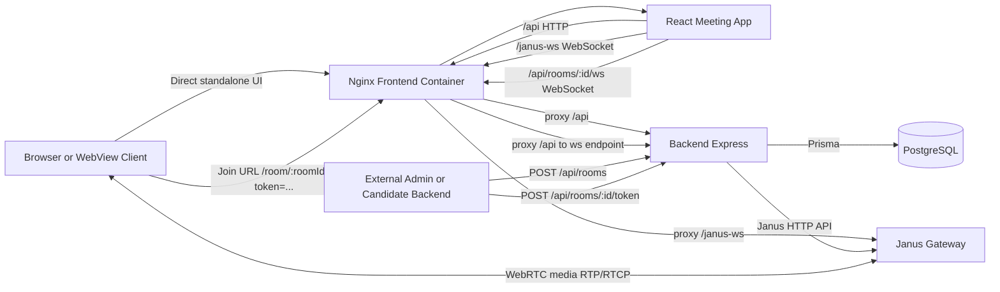
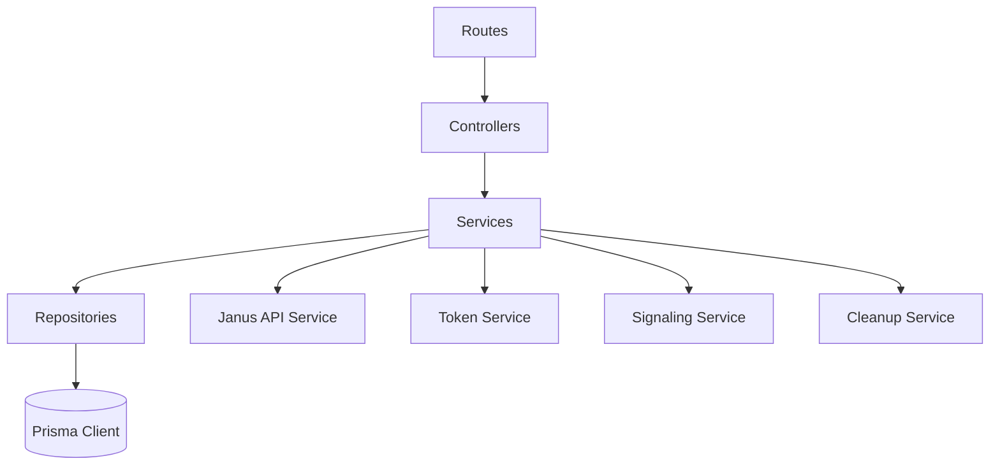

# Architecture

GTS Meet is a containerized Janus SFU platform that can run either as a standalone meeting app or as a dedicated meeting backend on a separate host or VPS.

## Contents

1. [High-Level Overview](#high-level-overview)
2. [System Diagram](#system-diagram)
3. [Core Components](#core-components)
4. [Runtime Flows](#runtime-flows)
5. [Backend Layering](#backend-layering)
6. [Data Model Summary](#data-model-summary)
7. [Design Notes](#design-notes)

## High-Level Overview

Architecture style:
- Realtime media via Janus VideoRoom (SFU)
- REST and WebSocket backend for room, token, message, and signaling orchestration
- React SPA frontend behind Nginx reverse proxy for direct meeting entry at `/` and `/room/:roomId`
- PostgreSQL persistence for rooms and messages
- Optional remote integration path where other GTS apps use this repo as their meeting service

Primary design choices:
- Browser clients talk same-origin to frontend Nginx (`/api`, `/janus-ws`), reducing CORS complexity for the built-in UI.
- Backend creates and destroys Janus rooms through the Janus HTTP API.
- External apps can create rooms or mint participant tokens through backend REST endpoints and reuse this frontend for the actual meeting UI.
- Collaboration signaling (hand-raise and whiteboard) uses backend WebSocket first.
- TextRoom is retained as a fallback path in frontend logic.

## System Diagram

## Core Components

Frontend:
- React + Vite UI in `frontend/src`
- `JanusService` encapsulates Janus SDK session, token handling, and signaling fallback behavior
- `Classroom` coordinates media UI, chat persistence, collaboration state, and layout modes (auto, grid, spotlight, pin)
- `WhiteboardSync` handles delta and snapshot synchronization for Excalidraw
- `Dashboard` provides direct room creation and join-by-ID when the repo is used standalone

Backend:
- Express app with layered architecture in `backend/src`
- Controllers: HTTP and WebSocket entrypoints
- Services: business workflows, token issuance, and Janus orchestration
- Data layer: Prisma repositories
- Jobs: periodic cleanup lifecycle

Infra:
- Docker Compose orchestrates Janus, DB, backend, and frontend
- Nginx serves the SPA and proxies API and WebSocket traffic
- Janus config lives under `conf/*.jcfg`
- The same stack can sit behind a dedicated domain and serve external GTS apps from a separate VPS

## Runtime Flows

### Standalone Room Creation Flow

1. User opens the dashboard at `/`.
2. Dashboard calls `POST /api/rooms`.
3. Backend creates both VideoRoom and TextRoom plugin rooms.
4. Backend stores room metadata in Postgres.
5. Frontend navigates to `/room/:roomId`.

### Remote Integration Flow

1. An external backend calls `POST /api/rooms` or `POST /api/rooms/:id/token` with `x-api-secret`.
2. Backend verifies `API_SHARED_SECRET` if configured.
3. Backend creates a room or returns a signed participant JWT.
4. External app builds or forwards a join URL targeting this repo's frontend: `/room/:roomId?token=...`.
5. User joins through the same frontend classroom used by standalone clients.

### Room Join Flow

1. Client lands on `/room/:roomId`, optionally with a signed `token` query parameter.
2. Frontend verifies the room via `GET /api/rooms/:id` when needed.
3. Frontend initializes Janus and opens a Janus session through `/janus-ws`.
4. Client joins VideoRoom using either direct dashboard identity or token-backed identity.
5. Client tries backend signaling WebSocket (`/api/rooms/:roomId/ws`).
6. Client attempts TextRoom join as a fallback or compatibility path.
7. Room UI switches to connected state.

### Realtime Collaboration Flow

1. UI action emits a signal payload.
2. `JanusService.sendSignal` uses backend signaling WebSocket if available.
3. Backend validates shape (`__signal` and `type`) and broadcasts to room peers.
4. If WebSocket path is unavailable, frontend may fallback to a TextRoom signal envelope.

### Room Lifecycle Flow

1. Backend creates both VideoRoom and TextRoom plugin rooms.
2. Room metadata is stored in Postgres with numeric `janusId` and UUID `id`.
3. Cleanup job checks Janus participants periodically.
4. Empty rooms older than threshold are removed from Janus and DB.

## Backend Layering

Current composition entrypoint:
- `backend/src/app.js` creates Express and registers middleware, routes, and websocket endpoint.
- `backend/src/container.js` wires repository, service, and controller dependencies.

## Data Model Summary

Room:
- `id` UUID (primary key)
- `janusId` numeric unique id used in Janus plugins
- `name`, `title`, `isPrivate`, `isLiveClass`, `maxUsers`
- `creatorId`, `creatorName`
- `createdAt`, `updatedAt`

Message:
- `id` UUID
- `roomId` FK to `Room.id`
- `sender`, `content`, `createdAt`

## Design Notes

- `app.set('trust proxy', 1)` is required because backend is normally behind an Nginx proxy.
- Nginx normalizes trusted LAN and localhost origins for Janus WebSocket proxying.
- CORS defaults are private-network oriented; production exposure should add explicit `CORS_ORIGINS` values.
- TextRoom can still carry chat and signaling envelopes, but backend signaling WebSocket is the preferred collaboration path.
- The built-in dashboard and `/room/:roomId` route remain supported even when this repo is deployed primarily as a separate meeting backend for other apps.
- On session destroy, all local media tracks (camera and mic) are explicitly stopped to release hardware.
