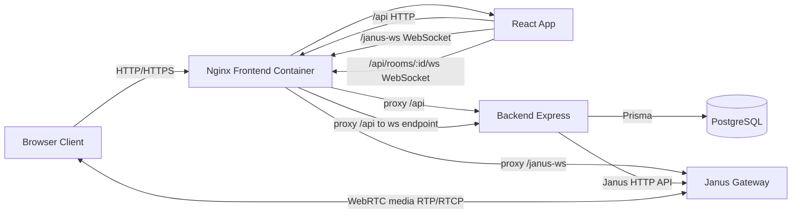
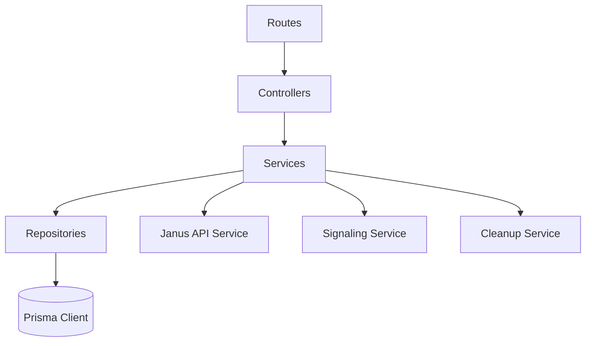

# Architecture

GTS Meet is a containerized video meeting platform built on Janus SFU.

## Contents

1. [High-Level Overview](#high-level-overview)
2. [System Diagram](#system-diagram)
3. [Core Components](#core-components)
4. [Runtime Flows](#runtime-flows)
5. [Backend Layering](#backend-layering)
6. [Data Model Summary](#data-model-summary)
7. [Design Notes](#design-notes)

## High-Level Overview

Architecture style:
- Realtime media via Janus VideoRoom (SFU)
- REST and WebSocket backend for room/message/signaling orchestration
- React SPA frontend behind Nginx reverse proxy
- PostgreSQL persistence for rooms and messages

Primary design choices:
- Browser talks same-origin to frontend Nginx (`/api`, `/janus-ws`), reducing CORS complexity.
- Backend creates and destroys Janus rooms through Janus HTTP API.
- Collaboration signaling (hand-raise and whiteboard) uses backend WebSocket first.
- TextRoom is retained as a fallback path in frontend logic.

## System Diagram

## Core Components

Frontend:
- React + Vite UI in `frontend/src`
- `JanusService` encapsulates Janus SDK session/handles and signaling fallback behavior
- `Classroom` coordinates media UI, chat persistence, collaboration state, and layout modes (auto/grid/spotlight/pin)
- `WhiteboardSync` handles delta/snapshot synchronization for Excalidraw
- `Dashboard` provides branded room creation with loading feedback

Backend:
- Express app with layered architecture in `backend/src`
- Controllers: HTTP/WebSocket entrypoints
- Services: business workflows and Janus orchestration
- Data layer: Prisma repositories
- Jobs: periodic cleanup lifecycle

Infra:
- Docker Compose orchestrates Janus, DB, backend, frontend
- Nginx serves SPA and proxies API and WebSocket traffic
- Janus config lives under `conf/*.jcfg`

## Runtime Flows

### Room Join Flow

1. Client verifies room via `GET /api/rooms/:id`.
2. Frontend initializes Janus library and opens Janus session through `/janus-ws`.
3. Client joins VideoRoom as publisher.
4. Client tries backend signaling WebSocket (`/api/rooms/:roomId/ws`).
5. Client attempts TextRoom join (fallback/compatibility path).
6. Room UI switches to connected state.

### Realtime Collaboration Flow

1. UI action emits signal payload.
2. `JanusService.sendSignal` uses backend signaling WebSocket if available.
3. Backend validates shape (`__signal` and `type`) and broadcasts to room peers.
4. If WebSocket path unavailable, frontend may fallback to TextRoom signal envelope.

### Room Lifecycle Flow

1. Backend creates both VideoRoom and TextRoom plugin rooms.
2. Room metadata is stored in Postgres with numeric `janusId` and UUID `id`.
3. Cleanup job checks Janus participants periodically.
4. Empty rooms older than threshold are removed from Janus and DB.

## Backend Layering

Current composition entrypoint:
- `backend/src/app.js` creates Express and registers middleware/routes/websocket endpoint.
- `backend/src/container.js` wires repository/service/controller dependencies.

## Data Model Summary

Room:
- `id` UUID (primary key)
- `janusId` numeric unique id used in Janus plugins
- `name`, `description`, `isPrivate`, `maxUsers`
- `createdAt`, `updatedAt`

Message:
- `id` UUID
- `roomId` FK to `Room.id`
- `sender`, `content`, `createdAt`

## Design Notes

- `app.set('trust proxy', 1)` is required because backend is behind Nginx proxy.
- Nginx normalizes trusted LAN/localhost origins for Janus WebSocket proxy.
- CORS defaults are private-network oriented; production internet exposure requires explicit origin policy updates.
- TextRoom can still carry chat and signaling envelopes, but backend signaling WebSocket is the preferred collaboration path.
- On session destroy, all local media tracks (camera/mic) are explicitly stopped to release hardware.
