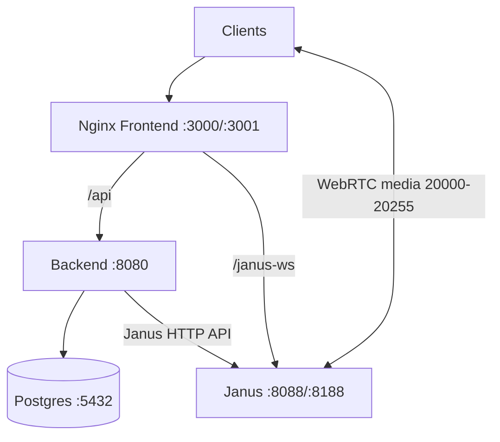

# Deployment

Deployment guidance for LAN and production-like environments.

## Contents

1. [Container Topology](#container-topology)
2. [Published Ports](#published-ports)
3. [Reverse Proxy Behavior](#reverse-proxy-behavior)
4. [LAN Deployment Checklist](#lan-deployment-checklist)
5. [Public Deployment Considerations](#public-deployment-considerations)
6. [Scaling and Capacity Notes](#scaling-and-capacity-notes)
7. [Deployment Diagram](#deployment-diagram)

## Container Topology

Docker Compose services:
- `janus-gateway`
- `db`
- `backend`
- `frontend`

Dependency flow:
- frontend depends on backend health and janus start
- backend depends on janus start and DB health

## Published Ports

| Service | Host Port | Container Port | Purpose |
|---|---:|---:|---|
| frontend | 3000 | 80 | UI HTTP |
| frontend | 3001 | 443 | UI HTTPS (self-signed cert in container) |
| backend | 8080 | 8080 | backend REST + WS |
| janus-gateway | 8088 | 8088 | Janus HTTP API |
| janus-gateway | 8188 | 8188 | Janus WebSocket transport |
| janus-gateway | 20000-20255/udp | 20000-20255/udp | RTP/RTCP media |
| janus-gateway | 20000-20255/tcp | 20000-20255/tcp | ICE-TCP fallback |
| db | 5432 | 5432 | Postgres |

## Reverse Proxy Behavior

Frontend Nginx handles all browser entry traffic:

- `/` serves built SPA assets
- `/api/*` proxies to backend
- `/health` proxies to backend health endpoint
- `/janus-ws` proxies to Janus WebSocket transport

Both `/api` and `/janus-ws` include WebSocket upgrade headers and long timeouts.

## LAN Deployment Checklist

1. Set `.env` values and run:

```bash
docker-compose up -d --build
```

2. Confirm services healthy:

```bash
docker-compose ps
curl http://localhost:8080/health
```

3. Confirm LAN access URL:

```text
http://<HOST_LAN_IP>:3000
```

4. Open firewall for:
- TCP 3000 (UI)
- UDP/TCP 20000-20255 (media)
- optionally backend/Janus ports for diagnostics

5. If clients are on different subnets/NAT boundaries, configure TURN and NAT mapping.

## Public Deployment Considerations

Current defaults are LAN-focused.

Before internet exposure:
- use trusted TLS certificates and secure `wss`/`https`
- tighten CORS and origin mappings to known domains only
- configure STUN/TURN for reliable NAT traversal
- secure secrets (`JANUS_API_SECRET`, DB credentials) with secret manager or protected env injection
- add network perimeter controls and observability

TextRoom guidance:
- TextRoom is still provisioned by backend for compatibility.
- Collaboration signaling should be treated as backend WebSocket primary path.

## Scaling and Capacity Notes

Practical scaling depends on:
- Janus CPU and network throughput
- number of active publishers/subscribers per room
- bitrate and screen-sharing patterns

Operational tips:
- keep media port range and firewall consistent
- monitor Janus load and session counts
- consider horizontal or regional strategies if user counts grow substantially

## Deployment Diagram



Related docs:
- [Quick Start](./QUICK_START.md)
- [Configuration Reference](./CONFIGURATION_REFERENCE.md)
- [Troubleshooting](./TROUBLESHOOTING.md)
