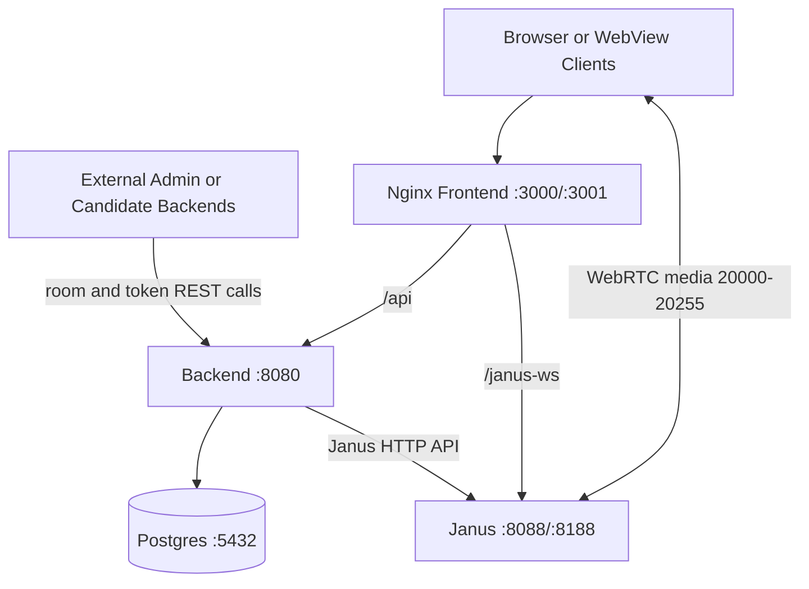

# Deployment

Deployment guidance for GTS Meet in LAN, VPS, and production-like environments.

## Contents

1. [Supported Topologies](#supported-topologies)
2. [Container Topology](#container-topology)
3. [Published Ports](#published-ports)
4. [Reverse Proxy Behavior](#reverse-proxy-behavior)
5. [LAN Deployment Checklist](#lan-deployment-checklist)
6. [Separate VPS Integration Checklist](#separate-vps-integration-checklist)
7. [Public Deployment Considerations](#public-deployment-considerations)
8. [Scaling and Capacity Notes](#scaling-and-capacity-notes)
9. [Deployment Diagram](#deployment-diagram)

## Supported Topologies

This repo supports two practical deployment models.

1. Standalone self-hosted meetings
  - Users open this repo's frontend directly.
  - The dashboard at `/` creates and joins meetings without any external app.

2. Separate VPS meeting service
  - This repo runs as a dedicated Janus stack on its own host or VPS.
  - External apps such as `gts-academy-admin` call the backend API to create rooms or mint participant tokens.
  - End users still load this repo's frontend for `/room/:roomId` and Janus media transport.

## Container Topology

Docker Compose services:
- `janus-gateway`
- `db`
- `backend`
- `frontend`

Dependency flow:
- frontend depends on backend health and Janus start
- backend depends on Janus start and DB health
- external app backends are outside this compose file and talk to the backend over HTTP

## Published Ports

| Service | Host Port | Container Port | Purpose |
|---|---:|---:|---|
| frontend | 3000 | 80 | UI HTTP |
| frontend | 3001 | 443 | UI HTTPS (self-signed cert in container) |
| backend | 8080 | 8080 | backend REST and signaling WS |
| janus-gateway | 8088 | 8088 | Janus HTTP API |
| janus-gateway | 8188 | 8188 | Janus WebSocket transport |
| janus-gateway | 20000-20255/udp | 20000-20255/udp | RTP and RTCP media |
| janus-gateway | 20000-20255/tcp | 20000-20255/tcp | ICE-TCP fallback |
| db | 5432 | 5432 | Postgres |

Operational note:
- browser users need access to the frontend origin and Janus media ports
- external app backends need access to the backend REST API, either directly on `:8080` or through a reverse proxy exposing `/api/*`

## Reverse Proxy Behavior

Frontend Nginx handles browser entry traffic:

- `/` serves built SPA assets
- `/api/*` proxies to backend
- `/health` proxies to backend health endpoint
- `/janus-ws` proxies to Janus WebSocket transport

Both `/api` and `/janus-ws` include WebSocket upgrade headers and long timeouts.

Practical access patterns:
- standalone browser clients usually hit the frontend origin only
- external app backends can call the backend directly or reuse the public frontend origin and its `/api/*` proxy

## LAN Deployment Checklist

1. Set `.env` values and run:

```bash
docker-compose up -d --build
```

2. Confirm services healthy:

```bash
docker-compose ps
curl http://localhost:8080/health
```

3. Confirm LAN access URL:

```text
http://<HOST_LAN_IP>:3000
```

4. Open firewall for:
- TCP 3000 for the UI
- UDP and TCP 20000-20255 for media
- optionally backend and Janus ports for diagnostics

5. If clients are on different subnets or NAT boundaries, configure TURN and NAT mapping.

## Separate VPS Integration Checklist

Use this when the Janus stack is deployed separately from the admin or candidate apps.

1. Deploy this repo with a stable public or private hostname.
2. Set `API_SHARED_SECRET` and `JWT_SECRET`.
3. Decide how external backends will reach the API:
  - direct backend port such as `http://meet-vps:8080/api/*`
  - public frontend origin such as `https://meet.example.com/api/*`
4. Set external app values to match that decision:
  - `JANUS_API_URL=<backend or proxied base>`
  - `JANUS_FRONTEND_URL=<public frontend origin>`
5. Ensure end users can reach the frontend origin and Janus media ports.
6. Restrict `CORS_ORIGINS` and perimeter access to trusted origins and networks.

## Public Deployment Considerations

Current defaults are LAN-focused.

Before internet exposure:
- use trusted TLS certificates and secure `wss` and `https`
- tighten CORS and origin mappings to known domains only
- configure STUN and TURN for reliable NAT traversal
- secure secrets (`API_SHARED_SECRET`, `JWT_SECRET`, `JANUS_API_SECRET`, DB credentials) with protected env injection
- add network perimeter controls and observability

TextRoom guidance:
- TextRoom is still provisioned by backend for compatibility.
- Collaboration signaling should be treated as backend WebSocket primary path.

## Scaling and Capacity Notes

Practical scaling depends on:
- Janus CPU and network throughput
- number of active publishers and subscribers per room
- bitrate and screen-sharing patterns

Operational tips:
- keep media port range and firewall consistent
- monitor Janus load and session counts
- consider horizontal or regional strategies if user counts grow substantially

## Deployment Diagram



Related docs:
- [Quick Start](./QUICK_START.md)
- [Configuration Reference](./CONFIGURATION_REFERENCE.md)
- [Troubleshooting](./TROUBLESHOOTING.md)
