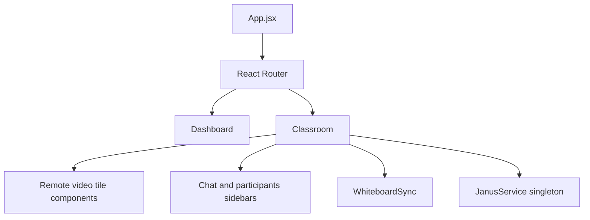
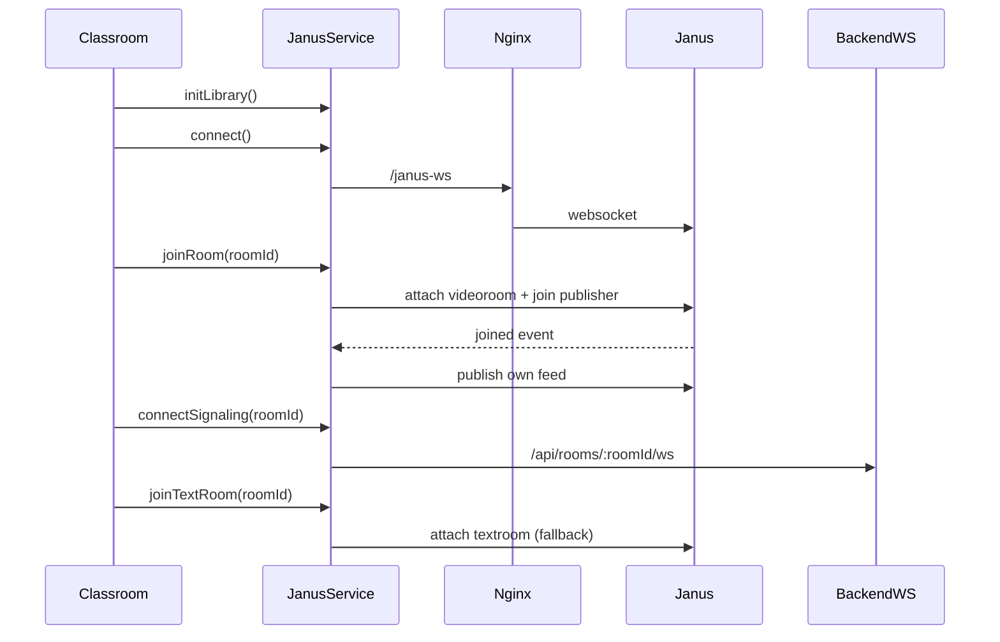

# Frontend Architecture

Frontend runtime architecture for classroom UI, Janus session handling, and collaboration wiring.

## Contents

1. [Tech Stack](#tech-stack)
2. [Core Files](#core-files)
3. [Component Structure](#component-structure)
4. [JanusService Lifecycle](#janusservice-lifecycle)
5. [Classroom Runtime State](#classroom-runtime-state)
6. [Chat and Signal Paths](#chat-and-signal-paths)
7. [Error and Fallback Behavior](#error-and-fallback-behavior)

## Tech Stack

- React 18
- React Router
- Vite
- Janus browser SDK (loaded from public script)
- Excalidraw for collaborative whiteboard

## Core Files

- `frontend/src/components/Classroom.jsx`
- `frontend/src/components/WhiteboardSync.jsx`
- `frontend/src/janus/JanusService.js`
- `frontend/src/components/Dashboard.jsx`

## Component Structure

## JanusService Lifecycle

High-level sequence:

1. `initLibrary()` initializes Janus global once.
2. `connect()` creates Janus session via `/janus-ws`.
3. `joinRoom(roomId, display)` attaches VideoRoom plugin as publisher.
4. `publishOwnFeed()` runs media pre-check and then creates publish offer.
5. `_subscribeToFeed()` attaches subscriber handles for remote publishers.
6. `connectSignaling(roomId)` opens backend WebSocket for collaboration events.
7. `joinTextRoom(roomId)` attempts TextRoom for chat/fallback signaling.
8. `destroy()` closes handles, sockets, tracks, and Janus session.

## Classroom Runtime State

Representative UI state in `Classroom`:
- media controls: mic, cam, screen share
- connection state: joining, connected, error
- sidebars: chat and participant list
- realtime presence: raised hands map
- feed maps: remote feeds and screen-share feeds
- whiteboard visibility and signal bus bridge
- pinned feed state for focus mode

Whiteboard signal routing:
- `Classroom` receives `onSignal` from JanusService
- forwards `wb-*` events to `WhiteboardSync` through `whiteboardSignalHandler`

## Chat and Signal Paths

Chat path:
1. user sends chat text
2. `JanusService.sendChatMessage` uses TextRoom when ready
3. message is persisted through backend API `POST /api/rooms/:roomId/messages`
4. client polls `GET /api/rooms/:roomId/messages` every 2 seconds

Signal path:
1. UI emits collaboration event (`hand-raise` or `wb-*`)
2. `JanusService.sendSignal` prefers backend WebSocket
3. if unavailable, fallback to TextRoom signaling envelope

## Error and Fallback Behavior

Media failures:
- camera/mic errors mapped to user-friendly messages
- video publish falls back to audio-only when possible

Signaling failures:
- backend WebSocket failure shows non-fatal notice
- TextRoom failure shows notice and relies on message-sync fallback behavior

Session cleanup:
- on route leave/unmount, `janusService.destroy()` is called
- closes signaling socket, stops local screen tracks, destroys Janus session

Related docs:
- [Media Streaming](./MEDIA_STREAMING.md)
- [WebSocket Signaling](./WEBSOCKET_SIGNALING.md)
- [Whiteboard Sync](./WHITEBOARD_SYNC.md)
