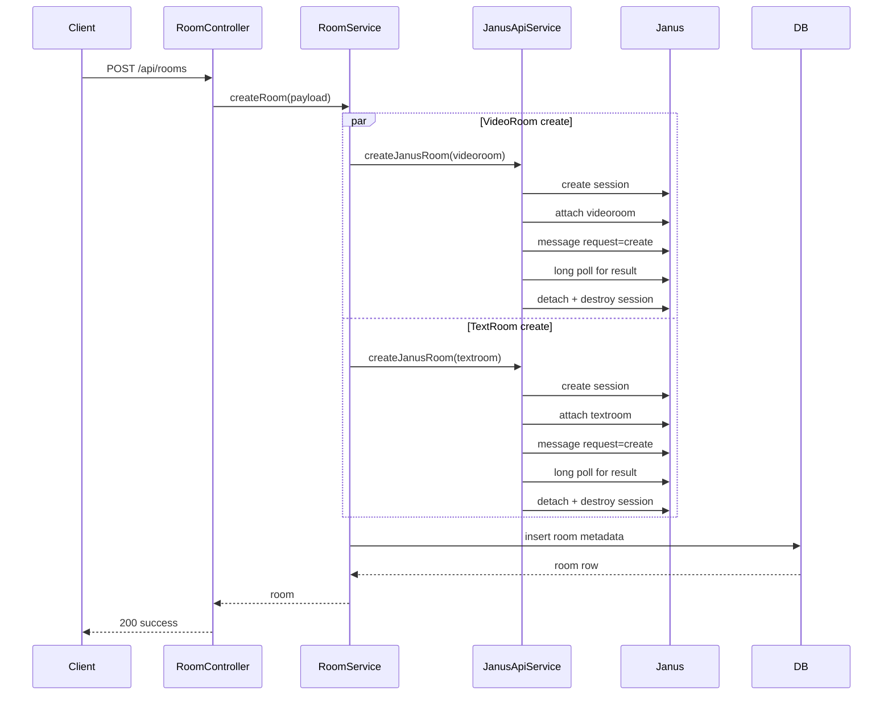
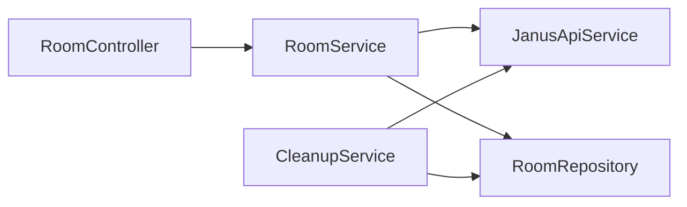

# Janus Integration

How the backend orchestrates Janus plugin rooms and participant checks.

## Contents

1. [Integration Surface](#integration-surface)
2. [Janus API Service Responsibilities](#janus-api-service-responsibilities)
3. [Room Creation Lifecycle](#room-creation-lifecycle)
4. [Room Destruction Lifecycle](#room-destruction-lifecycle)
5. [Participant Query Flow](#participant-query-flow)
6. [Backend Layer Interaction](#backend-layer-interaction)
7. [TextRoom Positioning](#textroom-positioning)

## Integration Surface

Backend communicates with Janus over HTTP API:
- Base URL: `JANUS_HTTP` (`http://janus-gateway:8088/janus` by default)
- Optional request auth: `JANUS_API_SECRET` appended as `apisecret`

Core Janus actions used:
- `create` (session)
- `attach` (plugin handle)
- `message` (plugin operation)
- `detach`
- `destroy` (session)

## Janus API Service Responsibilities

Implemented in `backend/src/services/janusApiService.js`.

Primary methods:
- `createJanusRoom(plugin, roomId, roomConfig)`
- `destroyJanusRoom(plugin, roomId)`
- `listParticipants(roomId)`
- low-level helpers: `janusRequest`, `janusLongPoll`

The service wraps Janus async behavior by pairing message calls with long poll retrieval where needed.

## Room Creation Lifecycle

Room creation is triggered by `POST /api/rooms`:

1. `RoomService` generates random numeric `janusId`.
2. Backend runs two create operations in parallel:
- `janus.plugin.videoroom`
- `janus.plugin.textroom`
3. If either fails, API returns 502 and DB insert is skipped.
4. If both succeed, room metadata is persisted via repository.

## Room Destruction Lifecycle

Destruction is used during cleanup:

1. Create temp session
2. Attach target plugin handle
3. Send `message` with `{ request: "destroy", room }`
4. Long poll for completion
5. Detach and destroy session

This runs for both plugins when deleting old idle rooms.

## Participant Query Flow

`CleanupService` checks whether room is empty using VideoRoom participants:

1. `listParticipants(room.janusId)`
2. backend sends VideoRoom `listparticipants` request
3. extracts `participants` array from `plugindata.data`
4. room is eligible for deletion if:
- `participants.length === 0`
- room age > 1 hour

## Backend Layer Interaction

Routing and composition:
- `createApp()` registers routes and WebSocket endpoint
- `createContainer()` wires repositories -> services -> controllers

## TextRoom Positioning

Current position in this repository:
- Backend still creates/destroys TextRoom rooms for compatibility
- Frontend tries TextRoom join for chat fallback
- Preferred collaboration signaling path is backend WebSocket (`/api/rooms/:roomId/ws`)

Practical implication:
- Deployments should keep TextRoom operational unless frontend fallback path is intentionally removed in code.
