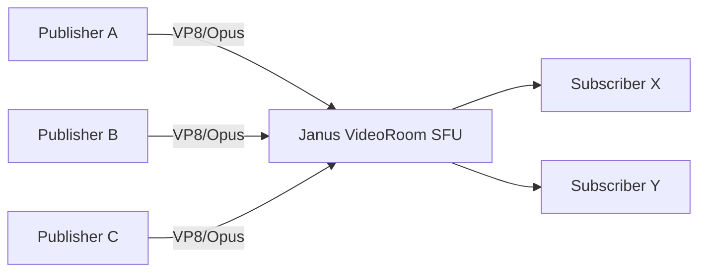

# Media Streaming

How audio/video and screen share streams are published, routed, and rendered.

## Contents

1. [SFU Model](#sfu-model)
2. [Publisher and Subscriber Roles](#publisher-and-subscriber-roles)
3. [Codec and Room Defaults](#codec-and-room-defaults)
4. [Publish Flow](#publish-flow)
5. [Subscribe Flow](#subscribe-flow)
6. [Screen Share Flow](#screen-share-flow)
7. [ICE and Network Considerations](#ice-and-network-considerations)

## SFU Model

The platform uses Janus VideoRoom as SFU.

Implication:
- each participant sends upstream media to Janus
- Janus forwards selected streams to subscribers
- clients avoid mesh explosion in multi-user calls

## Publisher and Subscriber Roles

Publisher role:
- joins room with `ptype: publisher`
- publishes local tracks after join event

Subscriber role:
- separate handle per remote feed
- joins with `ptype: subscriber` and `feed` id
- creates answer on incoming JSEP and starts media

## Codec and Room Defaults

Room creation defaults from backend Janus request:
- `audiocodec: opus`
- `videocodec: vp8`
- `bitrate: 512000`
- `fir_freq: 10`
- `publishers: maxUsers || 6`

These are applied when backend creates VideoRoom via Janus API.

## Publish Flow

1. Frontend joins VideoRoom as publisher.
2. On `joined` event, frontend calls `publishOwnFeed()`.
3. Browser runs `getUserMedia` pre-check.
4. If video cannot be captured, fallback tries audio-only publish.
5. Frontend creates offer with audio/video tracks.
6. Frontend sends `configure` + JSEP to Janus.

## Subscribe Flow

1. On room join or `event` updates, frontend receives publisher list.
2. For each remote publisher, frontend attaches subscriber handle.
3. Janus sends remote JSEP offer.
4. Frontend creates subscriber answer and sends `start`.
5. Remote tracks are added to a `MediaStream` and rendered in UI tiles.

## Screen Share Flow

Screen share uses a dedicated second publisher handle:

1. attach another VideoRoom plugin handle
2. join as publisher with display suffix `(screen)`
3. create offer using `type: screen` capture
4. send `configure` with video enabled, audio disabled
5. stop/unpublish when user ends share or track ends

UI treatment:
- screen feeds are tracked separately from normal camera feeds
- classroom can switch to presentation-like layout when screen is active

## ICE and Network Considerations

Frontend ICE resolution order:
1. use `VITE_ICE_SERVERS_JSON` if provided
2. fallback STUN: `stun:stun.l.google.com:19302`
3. add TURN from `VITE_TURN_*` when configured

Janus network considerations:
- docker-compose exposes media range `20000-20255` UDP/TCP
- Janus config sets matching `rtp_port_range`
- `ice_tcp = true` improves fallback in restricted networks

Operational guidance:
- for LAN tests, ensure client reaches host on frontend port and media range is open
- for public deployments, configure NAT mapping and TURN as needed

Related docs:
- [Frontend Architecture](./FRONTEND_ARCHITECTURE.md)
- [Deployment](./DEPLOYMENT.md)
- [Troubleshooting](./TROUBLESHOOTING.md)
