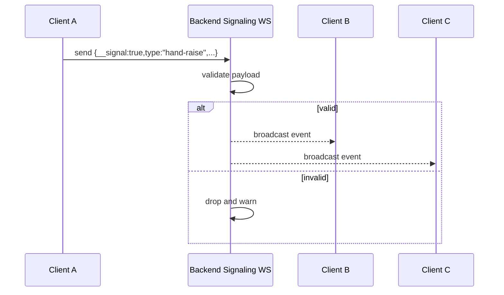

# WebSocket Signaling

Realtime signaling for hand-raise and whiteboard synchronization.

## Contents

1. [Purpose](#purpose)
2. [Primary Endpoint](#primary-endpoint)
3. [Message Contract](#message-contract)
4. [Broadcast Behavior](#broadcast-behavior)
5. [Client Fallback Strategy](#client-fallback-strategy)
6. [Flow Diagram](#flow-diagram)
7. [Operational Notes](#operational-notes)

## Purpose

This signaling channel carries lightweight room events that are not media streams:
- hand raise on/off
- whiteboard delta updates
- whiteboard snapshots and snapshot requests

It is separate from:
- Janus media transport (WebRTC)
- persisted chat API storage

## Primary Endpoint

Server endpoint:
- `ws(s)://<host>/api/rooms/:roomId/ws?token=<participant-jwt>`

Frontend uses same-origin URL computed from current page protocol/host/port.

Backend behavior:
- resolve `:roomId` by UUID or numeric `janusId`
- verify participant JWT from `token` query parameter
- if token missing/invalid: close socket code `1008`
- if room not found: close socket code `1008`
- if token room does not match target room: close socket code `1008`
- if valid: add socket to room subscriber map and send a `signaling-ready` handshake event

## Message Contract

Backend expects a JSON object containing:
- `__signal: true`
- `type: string`

If either field is missing, backend logs warning and drops message.

### Hand Raise Event

```json
{
  "__signal": true,
  "type": "hand-raise",
  "raised": true,
  "display": "User-1234"
}
```

### Signaling Ready Handshake

Backend sends this event after token + room validation succeeds:

```json
{
  "__signal": true,
  "type": "signaling-ready",
  "roomId": "room-uuid",
  "userId": "participant-id",
  "role": "candidate"
}
```

Frontend treats signaling as ready only after this handshake arrives.

### Whiteboard Delta Event

```json
{
  "__signal": true,
  "type": "wb-delta",
  "elements": [],
  "files": {},
  "appState": {
    "viewBackgroundColor": "#ffffff"
  }
}
```

### Whiteboard Snapshot Event

```json
{
  "__signal": true,
  "type": "wb-snapshot",
  "elements": [],
  "files": {},
  "appState": {
    "viewBackgroundColor": "#ffffff"
  }
}
```

### Whiteboard Snapshot Request

```json
{
  "__signal": true,
  "type": "wb-request-snapshot"
}
```

## Broadcast Behavior

Implemented by `SignalingService`.

Rules:
- message is broadcast to all subscribers in resolved room
- sender socket is excluded from rebroadcast
- disconnected sockets are removed
- empty subscriber set is cleaned up from map

Internal model:
- `Map<roomUUID, Map<WebSocket, ParticipantMeta>>`

## Client Fallback Strategy

Implemented in `JanusService.sendSignal(roomId, payload)`.

Order of operations:
1. Try backend signaling WebSocket.
2. If unavailable, fallback to TextRoom (if ready).
3. If both unavailable, return a failed send result so UI can show a clear notice.

This keeps collaboration functional in degraded mode when TextRoom is operational.

## Flow Diagram



## Operational Notes

- Proxy support: Nginx `/api/` location includes WebSocket upgrade headers.
- Long-lived sessions: read/send timeouts are set to 86400 seconds in frontend Nginx config.
- Security scope: backend CORS/origin policy currently targets localhost and private LAN ranges.
- This channel does not persist messages; it only fans out realtime events.

Related docs:
- [Backend API](./BACKEND_API.md)
- [Whiteboard Sync](./WHITEBOARD_SYNC.md)
- [Troubleshooting](./TROUBLESHOOTING.md)
