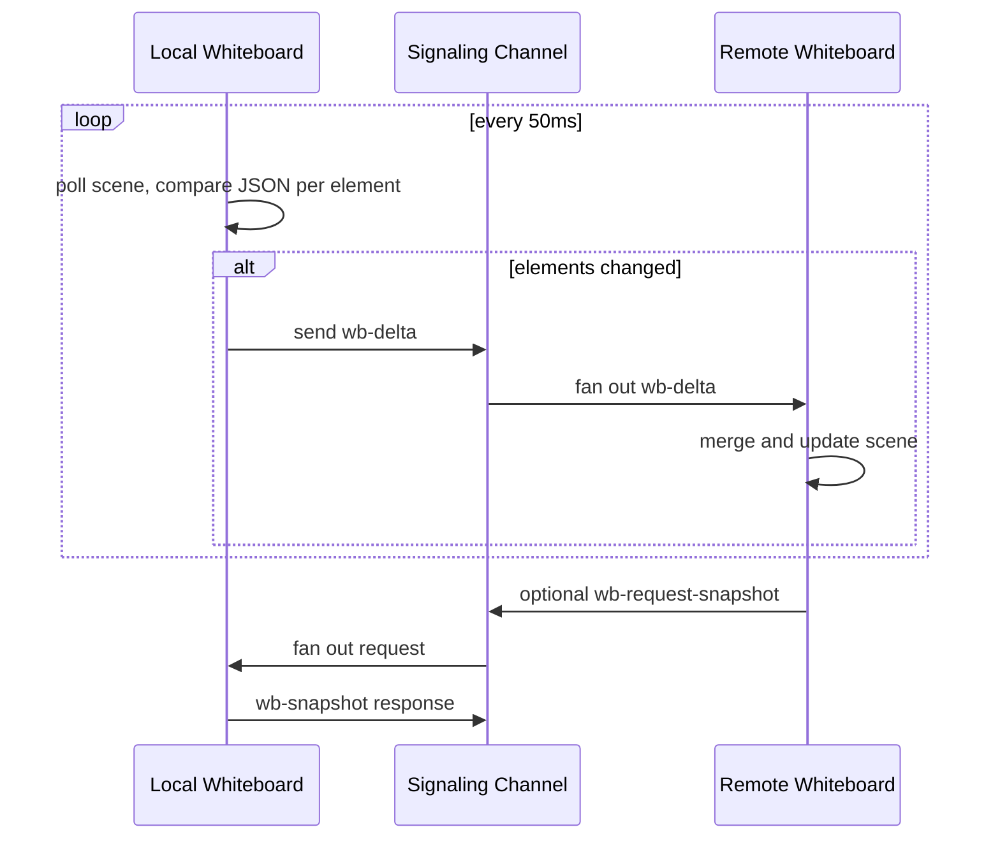
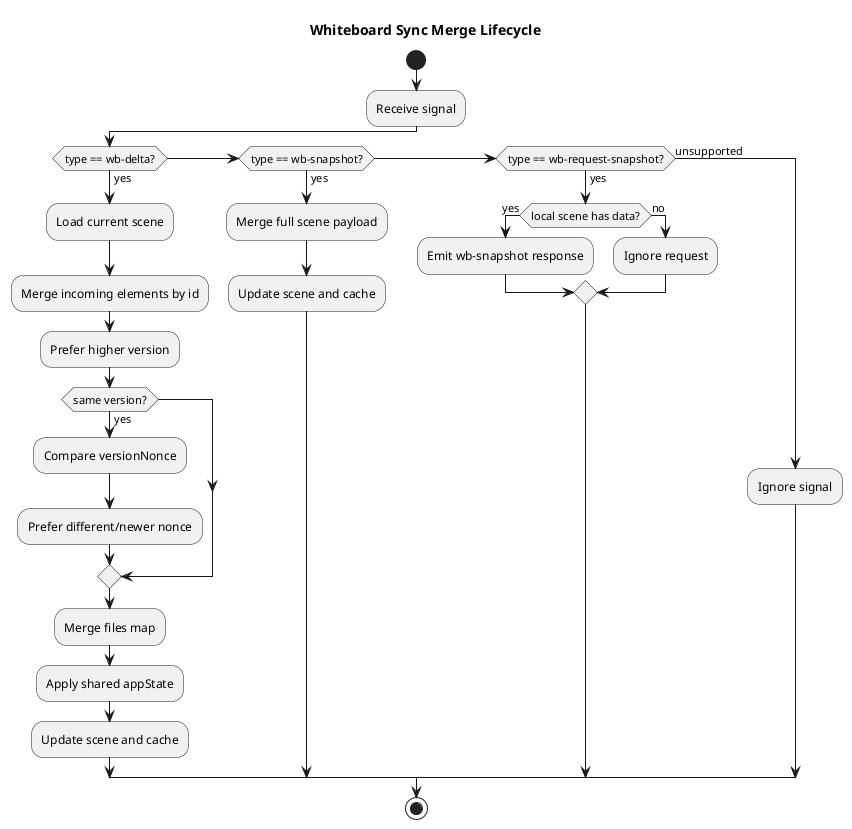

# Whiteboard Sync

Realtime collaborative whiteboard behavior using Excalidraw and signaling events.

## Contents

1. [Scope](#scope)
2. [Signal Types](#signal-types)
3. [Local Change Pipeline](#local-change-pipeline)
4. [Remote Merge Strategy](#remote-merge-strategy)
5. [Snapshot Recovery Pattern](#snapshot-recovery-pattern)
6. [Diagrams](#diagrams)
7. [Limitations](#limitations)

## Scope

Whiteboard collaboration is implemented in `frontend/src/components/WhiteboardSync.jsx` and wired through `Classroom` + `JanusService`.

State is synchronized through signaling events, not database persistence.

## Signal Types

- `wb-delta`: incremental element and app-state updates
- `wb-snapshot`: full scene sync payload
- `wb-request-snapshot`: request a peer to publish current full scene

Message envelope (when sent over signaling channel):

```json
{
  "__signal": true,
  "type": "wb-delta|wb-snapshot|wb-request-snapshot",
  "elements": [],
  "files": {},
  "appState": {}
}
```

## Local Change Pipeline

1. Excalidraw `onChange` fires on element creation/stroke finalization (not mid-stroke in v0.18).
2. A 50ms `setInterval` poll compares each scene element's JSON against a `lastSentElements` Map.
3. Changed elements (new or modified JSON) are collected as a delta batch.
4. Delta is sent as `wb-delta` over the signaling channel.
5. `lastSentElements` Map is updated with the new JSON strings.

Benefits:
- Reliable detection regardless of Excalidraw callback timing
- 50ms interval balances latency vs network overhead
- JSON.stringify comparison catches any property change including position, style, version

## Remote Merge Strategy

Remote incoming elements are applied using `excalidrawAPI.updateScene()` with `CaptureUpdateAction.IMMEDIATELY`.

Reconciliation strategy:
- Build map by `element.id`
- Merge remote elements over local (last-writer-wins by arrival)
- Update `lastSentElements` Map for merged elements to prevent echo
- Set `isApplyingRemote` ref during merge to suppress re-sending received elements

File reconciliation:
- merged by key (`fileId`) over local files map

App state reconciliation:
- currently focused on shared background color field

## Snapshot Recovery Pattern

On whiteboard mount:
1. component requests snapshot once (`wb-request-snapshot`)
2. peers with existing scene respond with `wb-snapshot`
3. receiver applies merge and updates cache

This avoids empty-room visual drift when joining after edits already happened.

## Diagrams

### Whiteboard Event Flow (Mermaid)



### Merge and Recovery Lifecycle (PlantUML)



Render note:
- Mermaid renders directly in many Markdown viewers.
- PlantUML requires a PlantUML-capable renderer or extension.

## Limitations

- No server persistence for whiteboard scene history.
- No built-in role permissions (all connected participants can edit).
- Ordering depends on signaling delivery and per-element version metadata.
- Very large scenes can increase snapshot payload size and network load.

Related docs:
- [WebSocket Signaling](./WEBSOCKET_SIGNALING.md)
- [Frontend Architecture](./FRONTEND_ARCHITECTURE.md)
- [Troubleshooting](./TROUBLESHOOTING.md)
